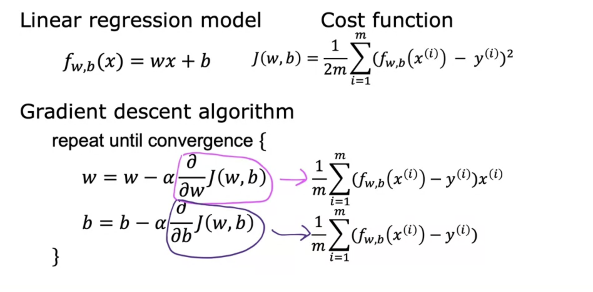

# Introduction to Machine Learning
## Overview of Machine Learning
## Supervised vs. Unsupervised Machine Learning
#### What is machine learning?
- supervised learning: used most in real-world applications, rapid advancements
- unsupervised learning
- recommender systems
- reinforcement learning
#### Supervised learning
- Supervised learning learns form data labeled with the "right answers"/ x to y mapping/x and y pairs
- Regression: predict a number from infinitely manay possible outputs
- Classification: predict categories from a small set of possible output/class output/class category using two or more inputs.
#### Unsupervised learning
- Unsupervised learning finds someting interesting/patterns/structures in unlabeled data
- Clustering: A type of unsupervised learning algorithm that takes data without labels and tries to automatically group them into clusters.
- Anomaly detection: find unusual data points
- Dimensionality reduction: compress data using fewer numbers
## Regression Model
#### Linear regression model
- Terminology:
	- Training set: data used to train the model including both the input features and output targets
	- $x$ = input variable feature
	- $y$ = output variable/ target variable
	- $m$ = number of trining expamles
	- $(x, y)$ = single training examples
	- $(x^i, y^i)$ = $i^{th}$ training examplt ($1^{st}, 2^{nd}, 3^{rd}$ ...)
	- $w, b$: parameters/ coefficients/ weights, w is the slope, b is the y-intercept

#### Cost function formula
- We minimize cost function to find $w, b$, so that $\hat{y}^i$ is close to $y^i$ for all $(x^i, y^i)$. 
- squared error cost function 

$$
J(w, b) = \frac{1}{2m}\sum_{i=1}^{m}(\hat{y}^i - y^i)^2 = \frac{1}{2m}\sum_{i=1}^{m}(f_{w,b}(x^i) - y^i)^2,
$$
 
where $\hat{y}^i - y^i$ is error, $m$ = number of training examples.

#### Visualizing the cost function

contour plots

## Train the model with gradient descent
#### Gradient descent
- Outline: 
	- start with some $w, b$ (such as set w=0, b=0)
	- keep changing $w, b$ to reduce $J(w,b)$
	- until we settle at or near a minimum (there may be more than 1 minimum)
- property: local minimima

#### Implementing gradient descent
- Gradient descent algorithm
	- $w = w -\alpha \frac{\partial}{\partial w}J(w,b)$,
	where $\alpha$ is the learning rate and it determines the size of the step you want to take,
	\= means assignment in programming, a == c means truth assertions,
	the derivative term determins in which direction do you want to take your steps
	- $b = b -\alpha \frac{\partial}{\partial b}J(w,b)$ 
	- Simultaneously update the two parameters w and b until the algorithm coveres at the minimum point

#### Gradient descent inuition

#### Learning rate
- If $\alpha$ is too small, gradient descent may be slow
- If $\alpha$ is too large, gradient descent may overshoot and never reach the minimum, in other words, gradient descen may fail to converge
- When gradient descent reaches the local minimum, the parameters will stop updating

#### Gradient descent for linear regression

- A convex function os of bowl-shaped function and it cannot have any local minima other than the single global minmum. When you implement gradient descent on a convex function, one nice property is that so lon gas your learning rate is chosen appropriately, it will always converge to the global minimum.
#### Running gradient descent
- batch gradient descent: in each step of gradient descent, we use all the training examples
- other gradient descent: subset

