# Regression with Multiple Input Variables
## Multiple Linear Regression
#### Multiple features
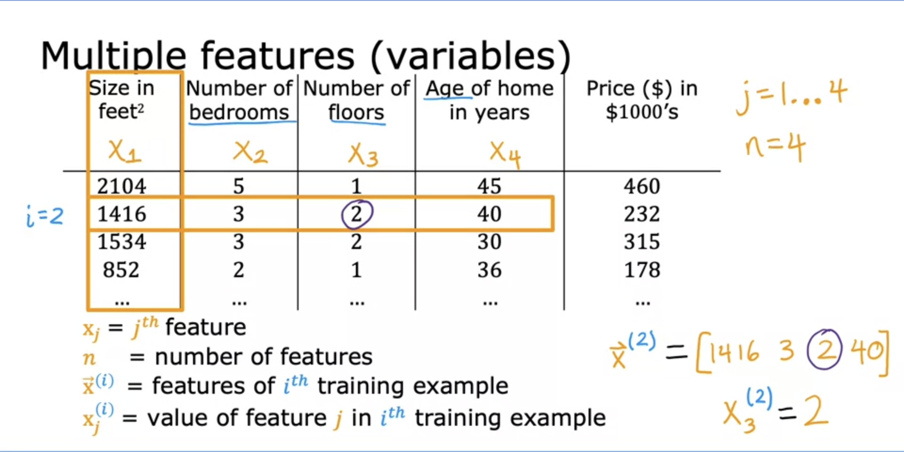
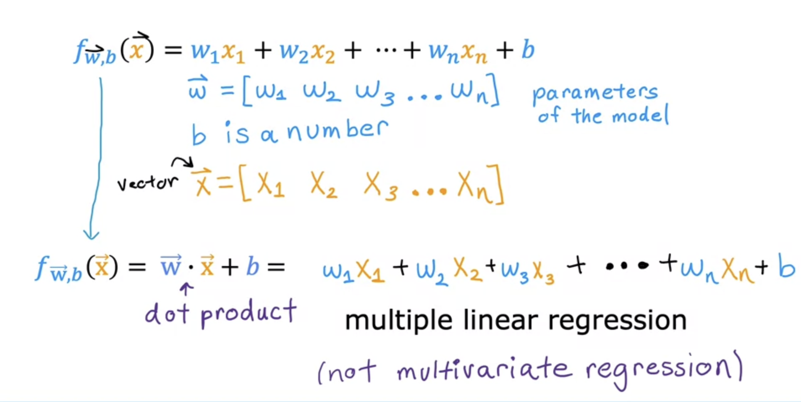

#### Vectorization
neat and faster
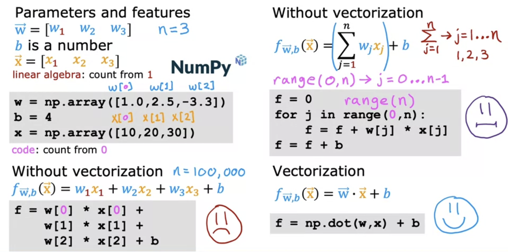
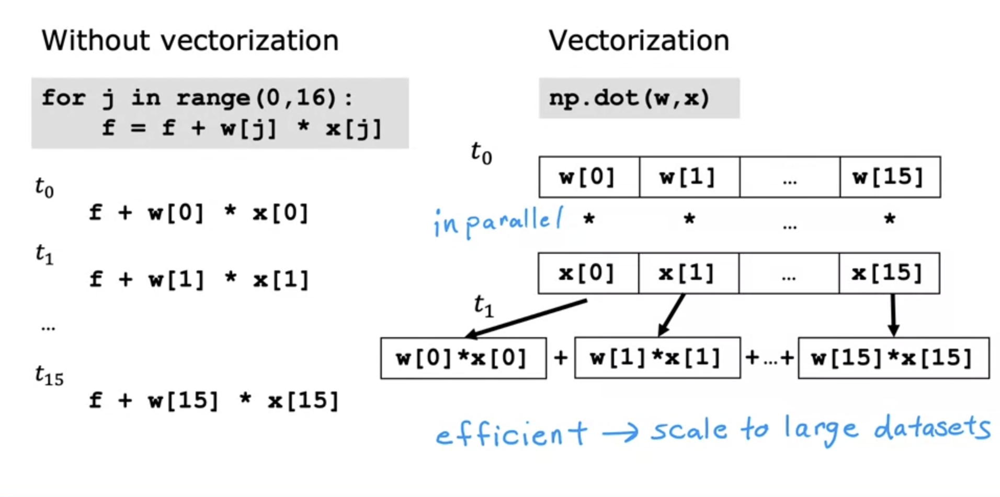
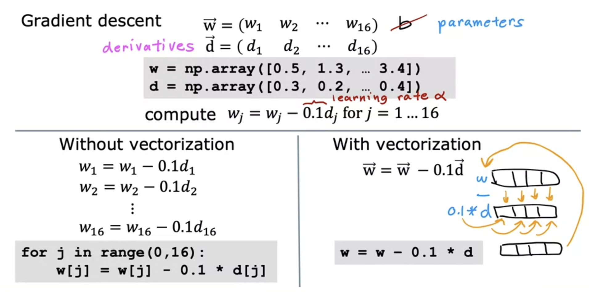

#### Optional lab: Python, NumPy and vectorization
#### Gradient descent for multiple linear regression
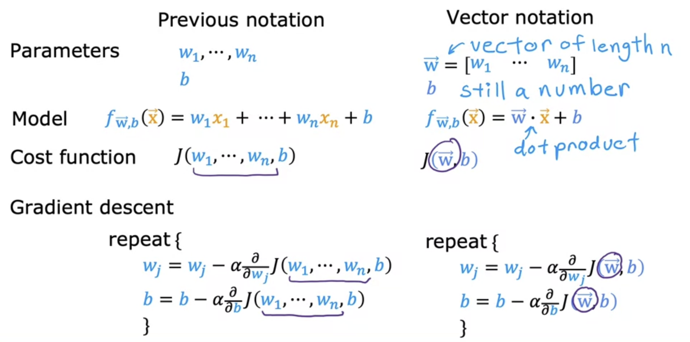
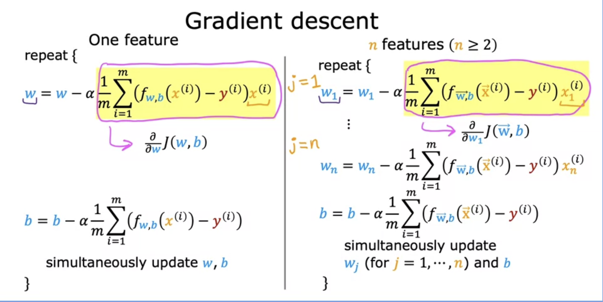
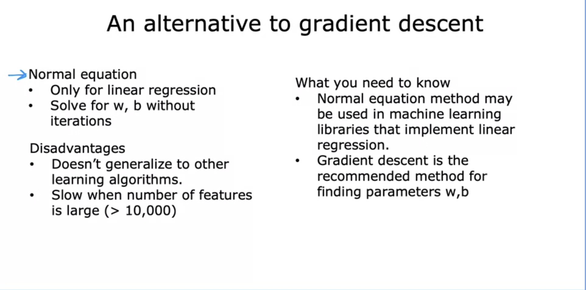

#### Optional Lab: Multiple linear regression
## Gradient Descent in Practice
#### Feature scaling
A good model will assign small value to $w$ when the value of $x_i$ is large
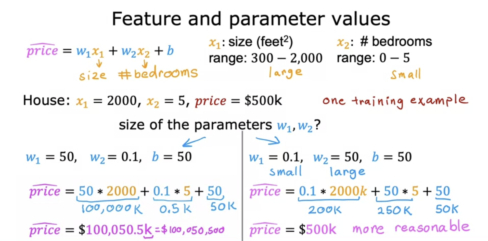

It takes small change in $w_1$ to have a large impact on y given the range of value of $x_1$ is large and vise versa.
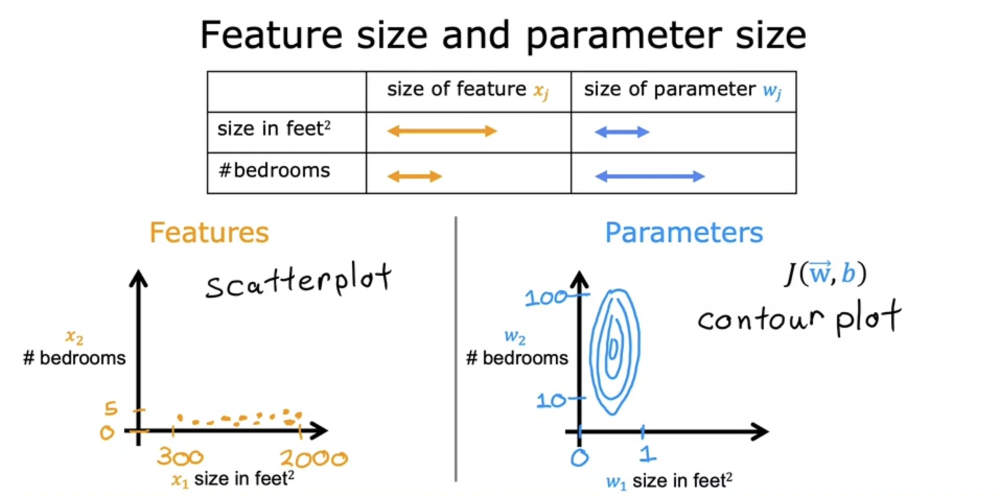

When the contour plot is skinny, gradient descent will bounce back and forth and therefore takes a long time to reach the minimum.
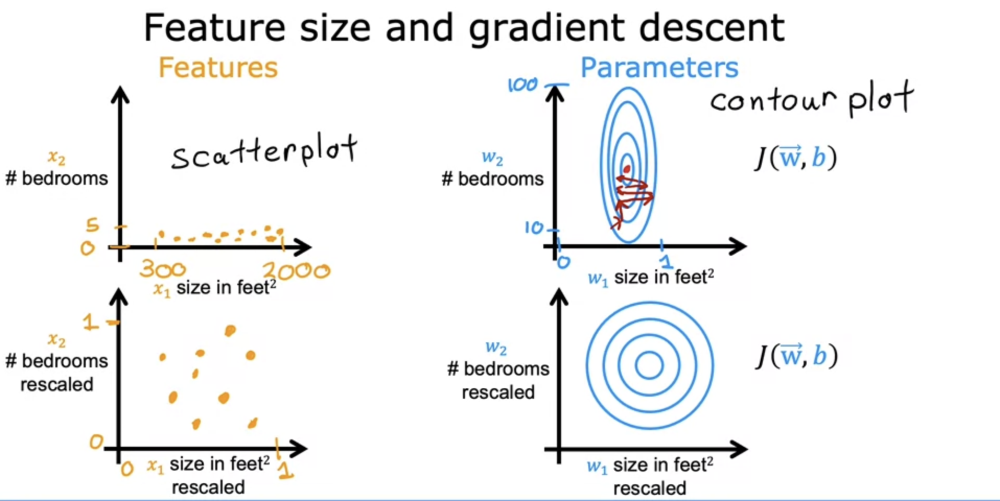

Feature scaling approach 1: max normalization
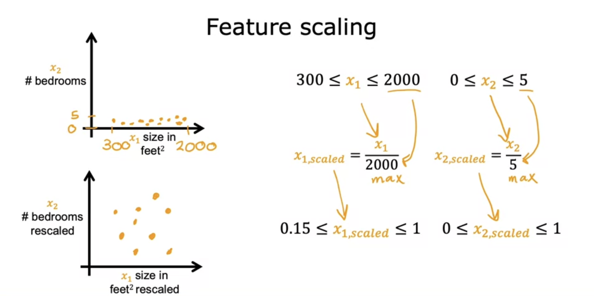

Feature scaling approach 2: mean normalization
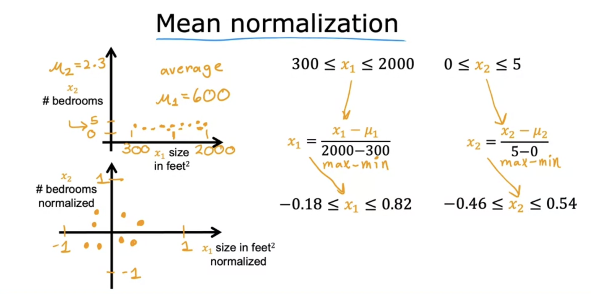

Feature scaling approach 3: z-score normalization
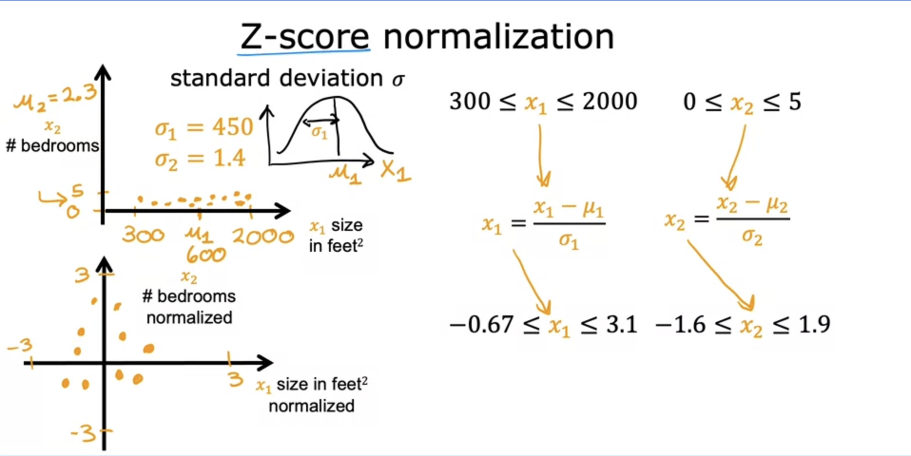

When do we need to do feature scaling. There is no harm in doing feature scaling.

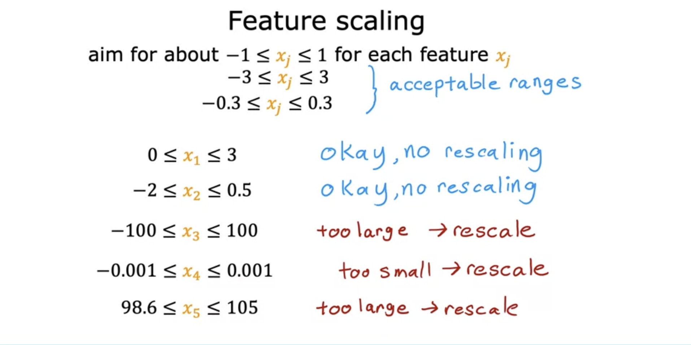

#### Checking gradient descent for convergence
- Learning curve: Adjust the learning rate. The number of iterations can varies a lot.
- Automatic convergence test: hard to choose an appropriate $\epsilon$ 
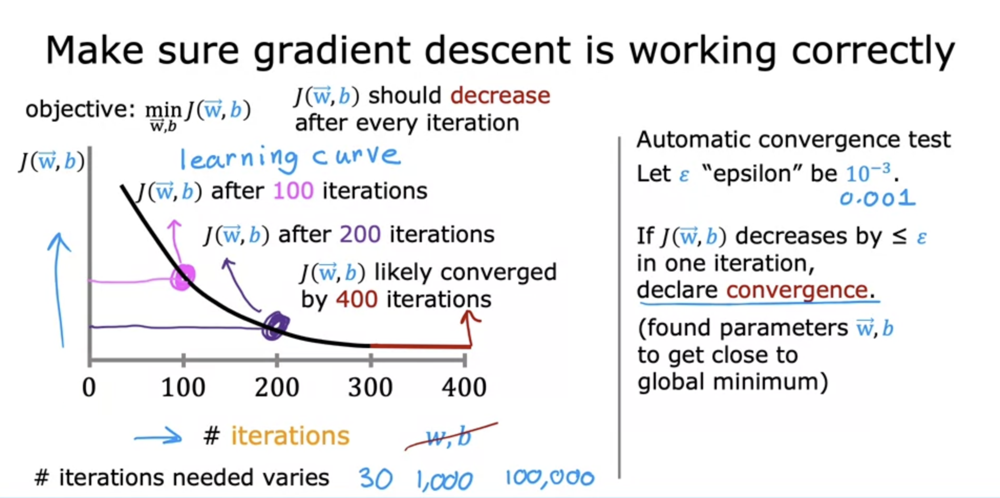

#### Choosing the learning rate
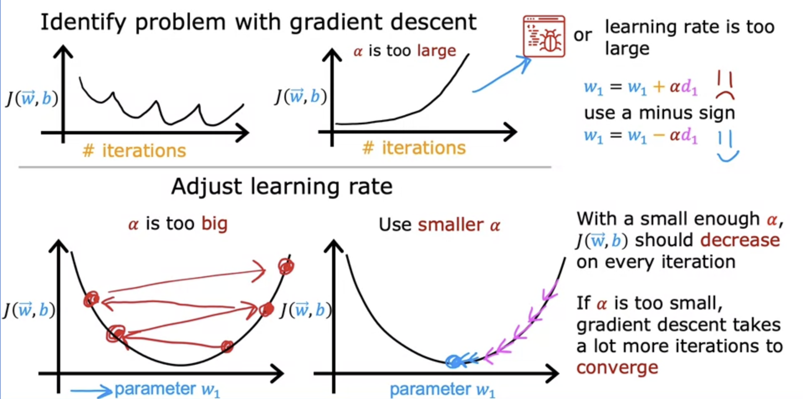

- Signs of problem: the learning curve fluctuate or keep increasing
- Potential problems, detection, and correction:
	- There is bugs in the code: test use a small enough $\alpha$ and see whether $J(\vec{w}, b)$  decrease on every iteration
	- Learning rate is too large: try a set of $\alpha$ for a handful of iterations and choose the $\alpha$ that seems to decrese the $J(\vec{w}, b)$ most rapidly.
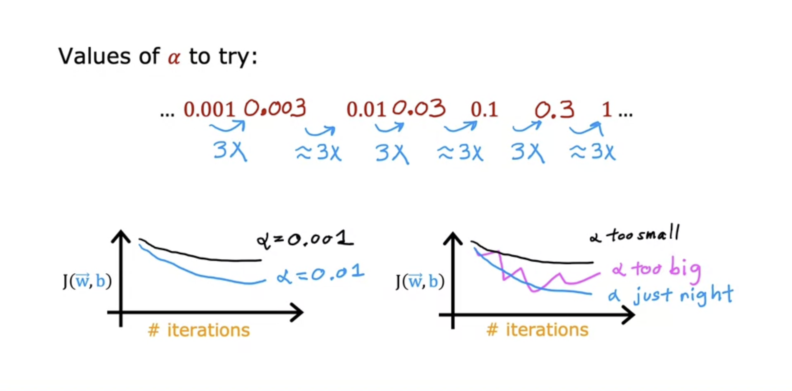

#### Optional Lab: Feature scaling and learning rate
#### Feature engineering
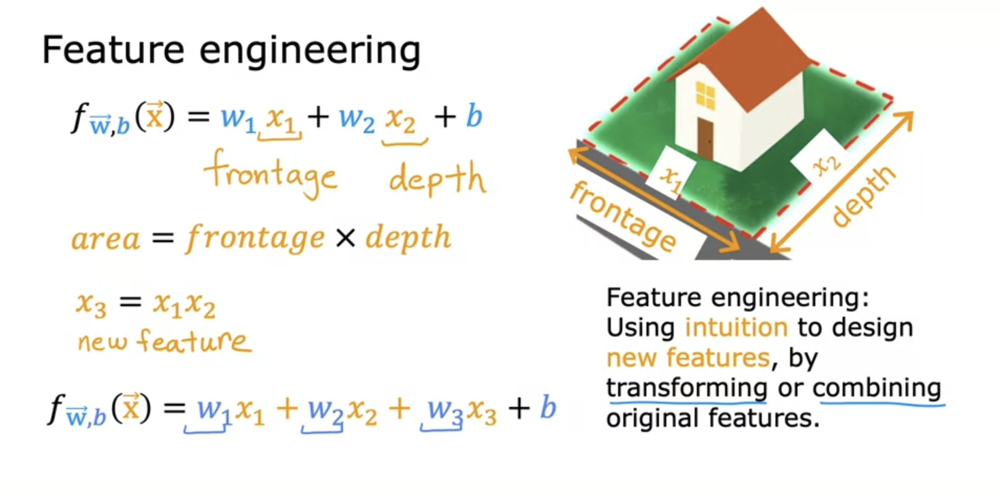

#### Polynomial regression
- It is important to do feature scaling in polynomial regression
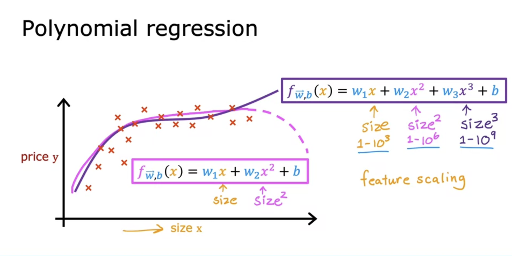

#### Optional Lab: Feature engineering and Polynomial regression
#### Optional Lab: Linear regression with scikit-learn
