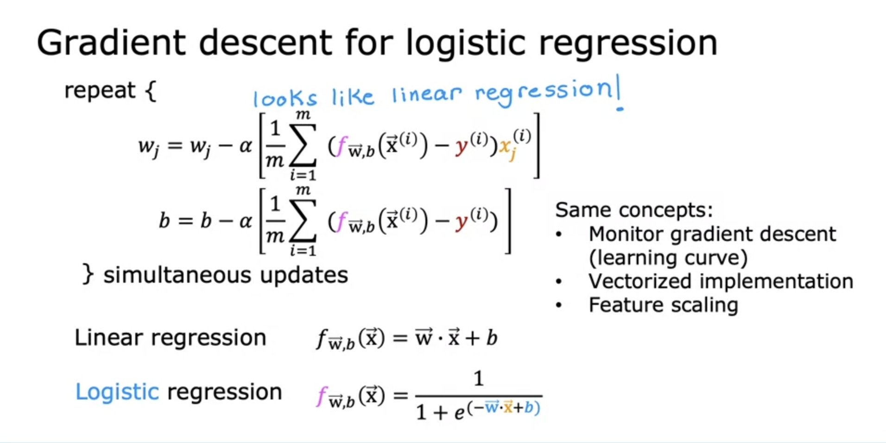

# Classification
## Classification with Logistic Regression
#### Motivations
- binary classification: the type of classification problem where there are only two possible outputs/classes/categories
- linear regression doesn't fit for classification
#### Optional lab: Classification
#### Logistic regression
- sigmoid funcion/logistic function

#### Optional lab: Sigmoid function and logistic regression
#### Decision boundary

- decision boundary can be linear and on-linear

#### Optional lab: Decision boundary
## Cost Function for Logistic Regression
#### Cost function for logistic regression
- squared error cost doesn't work for logistic regression because the cost plot is not convex which means there are a lot of local minimum that one can get stuck in when using gradient descent
- cost function for logistic regression
	$J(\vec w,b) = \frac{1}{m}\sum_{i-1}^{m}L(f_{\vec w, b}(\vec x^i),y^i)$
- loss function $L(f_{\vec w, b}(\vec x^i),y^i)$ 

#### Optional lab: Logistic loss
#### Simplified cost functio for logistic regression
- use maximum likelihood estimation to simplify the cost function for logistic regression

#### Optional lab: cost function for logistic regression
## Gradient Descent for Logistic Regression
#### Gradient descent implementation

#### Optional lab: gradient descent for logistic regression
#### Optional lab: Logistic regression wiht scikit-learn
## The Problem of Overfitting
#### The problem of overfitting
- underfit/high bias: the model does not fit the training set well
- generalization (just right): the model fits the training set pretty well
- overfitting/high variance: the model fits the training data well but does not work well with new examples that are not in the training set

#### Addressing overfitting
- collect more training data
- feature selection: all features + insufficient data $\rightarrow$ overfitting: select a subset of features to avoid overfitting (feature selection). The disadvantage is that useful features could be lost.
- reduce size of parameters - regularization: reduce the size of parameters $w_j$ (usually don't need to adjust $b$) . It lets you keep alll of your features but they prevents the features from having an overly large effect, which is what sometimes can cause overfitting.
#### Optional lab: Overfitting
#### Cost function with regularization
- by scaling the regularization term using $2m$ as the regular term for cost function, it becomes a bit easier to choose a good value for $\lambda$. In particular, even if your taining set size grow, say you find more training examples, $m$ makes the training size bigger and the same value of $\lambda$ that you've picked previously is now also more likely to continue to work.

- $\lambda$ balances the goals between fitting data and keeping $w_j$ small. If $\lambda$ equals to 0, then the model will be overfit. If $\lambda$ goes to infinity, the model is likely to be underfit because all the $w_j$ will be close to zero, in other words, all the features will be eliminated.

#### Regularized linear regression

- regularization multiplies $w$ by a number of slightly less than 1 on every single iteration, resulting in shrinking the value of $w_j$ just a little bit.

#### Regularized logistic regression

#### Optional lab: Regularization
